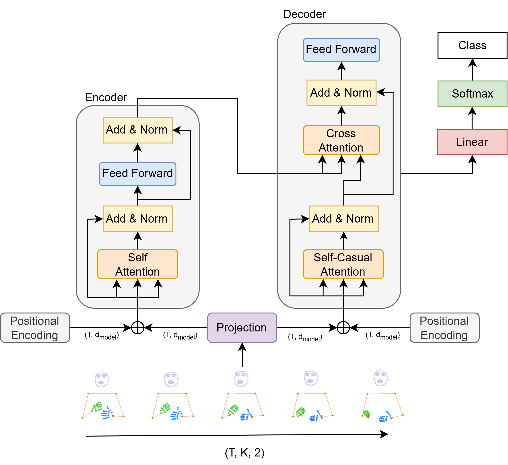

# [SignBart: A New Approach for Isolated Sign Language Recognition](https://arxiv.org/pdf/2506.21592)

**SignBart** introduces a novel method for Isolated Sign Language Recognition (ISLR) using skeleton sequences, focusing on decoupling the x and y coordinates and leveraging a lightweight encoder-decoder architecture based on BART.

<p align="center">

</p>

## Hightlights

- **Independent encoding of coordinates**: x and y coordinates are independently encoded to better capture their unique spatial characteristics.
- **Cross-Attention mechanism**: Cross-Attention integrates information between x and y after independent encoding.
- **Lightweight model**: Only ~750K parameters, making it significantly smaller than traditional SLR models.
- **High generalization ability**: Achieves superior performance on diverse datasets including LSA-64, WLASL, and ASL-Citizen.
- **Efficient skeleton sequence processing**: Lower computational costs compared to RNN, LSTM, GCN-based models.
- **Strong ablation results**: Highlights the importance of normalization, coordinate projection, and multi-part skeleton input.

## About the Model

SignBart addresses the limitations of treating skeleton keypoints as inseparable x-y pairs. Instead, it proposes:

- **Separate Coordinate Encoding**:

  - x-coordinates are encoded by the Encoder.
  - y-coordinates are encoded by the Decoder.

- **Attention Mechanisms**:

  - **Self-Attention** for x-coordinate encoding, allowing rich bidirectional context learning.
  - **Self-Causal-Attention** for y-coordinate encoding, maintaining temporal causality.
  - **Cross-Attention** to integrate information from x into y, preserving relational dependency.

- **Input Format**:

  - Skeleton data extracted using Mediapipe.
  - Shape: `(T, 75, 2)`, where T = frames, 75 = keypoints (6 body + 21 left hand + 21 right hand), 2 = (x, y).

- **Normalization**:

  - Each component (body, left hand, right hand) normalized independently based on its local bounding box.
  - Enhances model generalization and reduces overfitting.

- **Projection**:
  - Before entering attention layers, keypoints are linearly projected to a higher-dimensional space (d_model) to enrich feature representation.

## Dataset and Keypoints Extraction

| Dataset         | Videos  | Words | Signers | Language                                 |
| --------------- | ------- | ----- | ------- | ---------------------------------------- |
| **LSA-64**      | 3,200   | 64    | 10      | Argentinian Sign Language                |
| **WLASL**       | 21,083  | 2,000 | 119     | American Sign Language                   |
| **ASL-Citizen** | >84,000 | 2,731 | 52      | Community-sourced American Sign Language |

| Keypoint Extraction Process | Details                                                  |
| --------------------------- | -------------------------------------------------------- |
| Extraction Tool             | Google Mediapipe                                         |
| Keypoints                   | 6 body + full left & right hand                          |
| Missing Keypoints           | Filled with (0, 0)                                       |
| Coordinate Normalization    | Scaled to [0, 1] relative to frame size                  |
| Further Normalization       | Local bounding boxes for body, left hand, and right hand |

## Pretrained Weights

| Name             | Weight                                                                                                        | Config                                                 |
| ---------------- | ------------------------------------------------------------------------------------------------------------- | ------------------------------------------------------ |
| LSA-64           | [LSA-64.pth](https://drive.google.com/file/d/1UtQ_iQCzqXmIjWusJTJg8r0WAFM1RKsU/view?usp=drive_link)           | [LSA-64.yaml](configs/LSA-64.yaml)                     |
| WLASL-100        | [WLASL-100.pth](https://drive.google.com/file/d/1Ok14IGGExS61f6PJfysfN2vN5uwVkUyd/view?usp=drive_link)        | [WLASL-100.yaml](configs/WLASL-100.yaml)               |
| WLASL-300        | [WLASL-300.pth](https://drive.google.com/file/d/1hBZ0XK4Aqt5ymIt7td_7qXA32RiEQwQP/view?usp=drive_link)        | [WLASL-300.yaml](configs/WLASL-300.yaml)               |
| WLASL-1000       | [WLASL-1000.pth](https://drive.google.com/file/d/1MeGYgjesm-w94wEzlctEDiBFNmKLmVDG/view?usp=drive_link)       | [WLASL-1000.yaml](configs/WLASL-1000.yaml)             |
| WLASL-2000       | [WLASL-2000.pth](https://drive.google.com/file/d/1MeGYgjesm-w94wEzlctEDiBFNmKLmVDG/view?usp=drive_link)       | [WLASL-2000.yaml](configs/WLASL-2000.yaml)             |
| ASL-Citizen-100  | [ASL-Citizen-100.pth](https://drive.google.com/file/d/16WS8Y2ZjCnXYjmKenORwZ8JK0UrQ0vqp/view?usp=drive_link)  | [ASL-Citizen-100.yaml](configs/ASL-Citizen-100.yaml)   |
| ASL-Citizen-200  | [ASL-Citizen-200.pth](https://drive.google.com/file/d/1Qvk90YhZ_OCAoA0lActHMfaH-NEdZsep/view?usp=drive_link)  | [ASL-Citizen-200.yaml](configs/ASL-Citizen-200.yaml)   |
| ASL-Citizen-400  | [ASL-Citizen-400.pth](https://drive.google.com/file/d/1KHl-2NHHxsUNgj_IhLuAMGMkOp0XLrd9/view?usp=drive_link)  | [ASL-Citizen-400.yaml](configs/ASL-Citizen-400.yaml)   |
| ASL-Citizen-1000 | [ASL-Citizen-1000.pth](https://drive.google.com/file/d/1T7gNtwoQr_c7VduCax0Ii5Tk4KzPrUp8/view?usp=drive_link) | [ASL-Citizen-1000.yaml](configs/ASL-Citizen-1000.yaml) |
| ASL-Citizen-2731 | [ASL-Citizen-2731.pth](https://drive.google.com/file/d/1VjnkeYS3MiVpz5ey2AmV5pgWc7DA34Df/view?usp=drive_link) | [ASL-Citizen-2731.yaml](configs/ASL-Citizen-2731.yaml) |

## Installation

**Prerequisites**

- Python >= 3.8
- pip

**Setup**

```bash
# Clone and enter project
git clone https://github.com/tinh2044/SignBart.git
cd SignBart

# (Optional) create virtual environment
python -m venv venv
# macOS/Linux: source venv/bin/activate
# Windows PowerShell: venv\Scripts\Activate.ps1

# Install dependencies
pip install -r requirements.txt
```

**Data Preparation**

1. Download each dataset (LSA-64, WLASL, ASL-Citizen) from its source.
2. Extract into `data/` with structure:
   ```
   data/lsa-64/{label2id.json,id2label.json,train/,test/}
   data/wlasl/{...}
   data/asl-citizen/{...}
   ```

## Usage

Below are two ways to run SignBart: via provided shell scripts or by calling `main.py` directly.

### Using shell scripts

The `scripts/` directory includes dataset-specific training and evaluation scripts. For example:

```bash
# Training on LSA-64
bash scripts/train_LSA-64.sh
# Evaluation on LSA-64
bash scripts/eval_LSA-64.sh
```

You can replace dataset names to run other scripts (e.g., `train_WLASL-100.sh`, `eval_ASL-Citizen-100.sh`).

### Using Python entry point

Train:

```cmd
python main.py --task train \
  --experiment_name my_experiment \
  --config_path configs/lsa-64.yaml \
  --data_path data/lsa-64 \
  --epochs 200 \
  --lr 2e-5 \
  --seed 379
```

Evaluate:

```bash
python main.py --task eval \
  --experiment_name my_experiment \
  --config_path configs/lsa-64.yaml \
  --pretrained_path checkpoints/my_experiment/epoch_X.pth \
  --data_path data/lsa-64 \
  --seed 379
```

Optional flags:

- `--resume_checkpoints PATH`
- `--scheduler_factor FACTOR`
- `--scheduler_patience PATIENCE`

## Experiments and Results

### LSA-64 Dataset

| Model        | Accuracy   | Parameters  |
| :----------- | :--------- | :---------- |
| SPOTER       | 100%       | 5,918,848   |
| HWGATE       | 98.59%     | 10,758,354  |
| ST-GCN       | 92.81%     | 3,604,180   |
| SL-GCN       | 98.13%     | 4,872,306   |
| **SignBart** | **96.04%** | **749,888** |


### WLASL Dataset

| Subset     | SignBart Accuracy |
| :--------- | :---------------- |
| WLASL-100  | 78.00%            |
| WLASL-300  | 78.50%            |
| WLASL-1000 | 81.45%            |
| WLASL-2000 | 68.00%            |

### ASL-Citizen Dataset

| Subset           | Accuracy | Parameters |
| :--------------- | :------- | :--------- |
| ASL-Citizen-100  | 80.32%   | 754,532    |
| ASL-Citizen-200  | 81.49%   | 2,845,384  |
| ASL-Citizen-400  | 78.96%   | 3,424,144  |
| ASL-Citizen-1000 | 81.45%   | 3,578,344  |
| ASL-Citizen-2731 | 75.22%   | 4,548,523  |

### Ablation Studies

| Projection Effect  | Accuracy |
| ------------------ | -------- |
| Without projection | 62.08%   |
| With projection    | 96.04%   |

| Normalization Effect                               | Accuracy |
| -------------------------------------------------- | -------- |
| No normalization                                   | 82.50%   |
| One bounding box                                   | 90.52%   |
| Two bounding boxes                                 | 90.41%   |
| Three bounding boxes (body, left hand, right hand) | 96.04%   |

| Skeleton Components                  | Accuracy |
| ------------------------------------ | -------- |
| Only body                            | 86.97%   |
| Only left hand                       | 23.02%   |
| Only right hand                      | 70.20%   |
| Both hands                           | 91.35%   |
| All components (body + left + right) | 96.04%   |